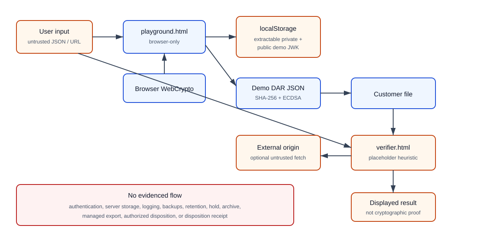

# Current-State Data Flow and Trust Boundaries

Editable source: [current-data-flow.mmd](diagrams/current-data-flow.mmd).

## Flow A — Static site delivery

1. A maintainer commits static source to GitHub.
2. An unverified deployment/hosting path may publish the files; no deployment configuration is in the repository.
3. A hosting/CDN endpoint returns HTML to a visitor's browser. The provider may process request metadata, but provider/configuration/retention are unknown.

Trust boundaries crossed: maintainer to repository (TB-1), repository/deployment to hosting (unverified), hosting to browser (TB-2).

## Flow B — Demonstration receipt issuance

1. The user supplies action type, pseudonymous subject, application ID, and context JSON.
2. Browser WebCrypto generates an extractable ECDSA P-256 key pair; JWKs are written to localStorage.
3. Browser code deterministically serializes context, hashes it with SHA-256, creates receipt metadata, hashes the payload, and signs the payload hash.
4. Receipt JSON, including the public JWK, is displayed. The user may download receipt/context JSON.

Trust boundaries crossed: user input to code (TB-3), code to browser persistence (TB-5), browser to user-controlled filesystem. This is a demonstration, not an approved issuer. There is no authenticated actor, trusted time source, protected signing key, issuer registry, schema enforcement, durable server store, audit log, or revocation check.

## Flow C — Playground verification

1. The user pastes receipt/context/public-key JSON or uses values produced locally.
2. Browser code recomputes context and payload hashes and verifies th…1489 tokens truncated… | Receipt | Basic generation only | Assess inference risk and tenant segregation |
| `context_hash`, `payload_hash`, artifact/policy/model references | Receipt metadata; may be Confidential | Receipt | Receipt | SHA-256 demonstration | Hashes do not anonymize low-entropy inputs; prohibit secrets/raw sensitive values |
| Context JSON (`app_id`, terms hash, session/device hashes) | Internal/Confidential; Personal if linkable | Playground textarea | Browser memory; optional user download | No minimization validation | Do not include raw session/device data; use approved scoped identifiers |
| Pasted/uploaded verifier input | Same classification as receipt; potentially Restricted | `verifier.html` DOM | Browser memory | Display redaction covers a small key-name list only | Treat as untrusted; early pilots may not process sensitive content |
| Receipt reference URL | Confidential/Personal depending on path/query | Verifier input and outbound request | Browser/history/network systems | Offline toggle defaults on | Allowlist origins before production; prohibit credentials/query secrets |
| Browser/network telemetry (IP, user agent, request time) | Personal data; Internal | Hosting/CDN/browser | Unknown | No repository evidence | Inventory provider, purpose, retention, residency, access |
| Repository contributor metadata | Personal/Internal | Git/GitHub | Git history | Platform-managed | Govern access and retention through repository policy |

## Data lifecycle findings

- Collection is direct in the browser. No server collection by DAR code is evidenced.
- The playground persists extractable demo key material indefinitely in origin-scoped localStorage until reset or browser storage removal.
- Receipt and context downloads are controlled by the user and fall under the user's device/storage controls.
- The verifier may send a GET request to an arbitrary user-supplied URL, exposing client network metadata and URL contents to that destination and any intermediaries.
- No repository-evidenced retention, legal hold, archival, export service, authorized disposition, backup, or deletion workflow exists.
- Git history is durable but is not an approved store for receipts, customer data, keys, tokens, or evidence.

## Approved lifecycle and schema requirements

- Customer-controlled custody is the default; DAR retains no customer receipt content by default.
- Demonstrations use synthetic or explicitly approved non-sensitive data.
- Any temporary demonstration storage expires within 30 days or less unless a documented approved exception applies.
- The core receipt has a strict, versioned, minimal schema, rejects unknown fields by default, and contains no unrestricted free-form customer content.
- Customer-authorized records roles control legal holds. Disposition requires policy eligibility, a no-hold check, and auditable authorization.
- Disposition receipts contain only minimal authority and opaque lifecycle metadata, never deleted protected content.

These are accepted requirements without current technical enforcement.

## Minimization rule for early pilots

Receipt payloads must be limited to an approved receipt schema containing opaque, tenant-scoped identifiers and cryptographic digests of separately governed artifacts. A digest is still sensitive when it enables confirmation attacks, correlation, or inference. Raw source content must remain in the customer's authorized system of record.
