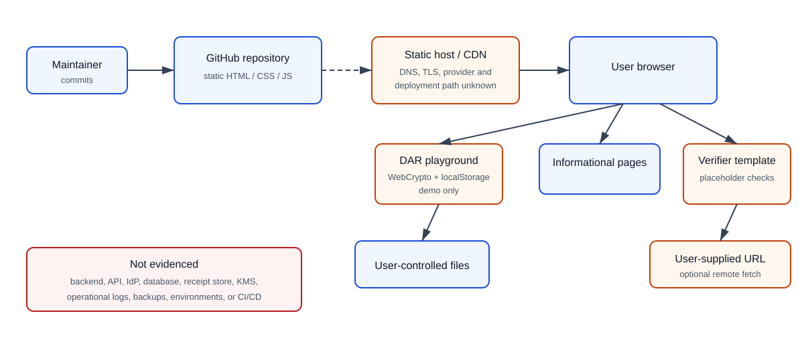

# Current System Boundary and Service Inventory

## Boundary statement

The evidenced DAR system is the public source repository plus static assets delivered to and executed by an end user's browser. The repository provides descriptive pages and two browser experiences:

1. `playground.html`, a functional local demonstration that creates an extractable ECDSA P-256 key pair in the browser, stores private and public JWKs in `localStorage`, creates a demonstration receipt, and verifies it using WebCrypto.
2. `verifier.html`, a UI template that accepts pasted/uploaded JSON or optionally fetches a user-supplied URL. Its `verifyReceipt()` function only checks for fields and explicitly labels itself placeholder logic; it does not cryptographically verify a receipt.

No evidence supports expanding the assessed application boundary to a backend, API, database, central receipt service, identity provider, or managed key service.

Editable source: [current-architecture.mmd](diagrams/current-architecture.mmd).

## Application and service inventory

| Component | Purpose | Data handled | Location / evidence | Current status |
|---|---|---|---|---|
| Static informational site | Explains DAR concepts, boundaries, domains, and use cases | Public content; ordinary web request metadata may be handled by unknown hosting | Root `*.html`, `README.md` | Evidenced in source |
| DAR playground | Browser-local demonstration issuance and verification | User-entered context; pseudonymous subject; hashes; receipt; demo private/public JWKs | `playground.html` | Prototype only |
| Verifier template | Accepts receipt JSON/file/reference and renders heuristic result | Receipt fields; uploaded/pasted JSON; optional remote response | `verifier.html` | Placeholder; not a cryptographic verifier |
| Browser WebCrypto | Generates P-256 keys, SHA-256 hashes, signs/verifies demo DARs | Extractable demo key material and receipt data in browser memory | `playground.html` | Browser platform dependency |
| Browser localStorage | Persists demo private/public JWK | Extractable private and public JWK | `playground.html` | Demonstration-only, prohibited for production keys |
| User-selected remote URL | Optional receipt fetch when offline mode is disabled | URL, network metadata, returned content | `verifier.html` `fetch(ref)` | Untrusted external integration |
| GitHub repository | Source custody and change history | Source, documentation, contributor metadata | Git remote and history | Evidenced; administrative controls not evidenced |
| Static hosting/CDN/DNS/TLS | Presumed delivery path if published | Site files and request metadata | No repository configuration | Unknown / outside evidenced boundary |

## Inventory explicitly absent from repository evidence

- Authentication, accounts, sessions, authorization roles, administrative console, service identities.
- Backend/serverless functions, APIs, queues, schedulers, workers, or receipt issuance service.
- Databases, object stores, append-only ledgers, backups, archives, or disaster-recovery resources.
- Production signing keys, secrets manager, key rotation, revocation, or issuer registry.
- Deployment workflow, environment separation, infrastructure-as-code, rollback controls, or production approvals.
- Operational/security logs, metrics, alerting, audit trails, or log retention.
- Automated tests, test runner, CI security checks, dependency inventory, SBOM, or vulnerability scanning.
- Documented cloud services, subprocessors, data residency, owners, or support/incident contacts.

## Environments

Only a source branch and browser execution context are evidenced. Development, test, preview, staging, and production environments are not defined. A publicly reachable site must not be treated as an evidenced production environment merely because these files can be statically hosted.

## Boundary ownership

| Area | Provisional owner | Evidence state |
|---|---|---|
| Repository content and Phase A documents | DAR founder/product owner | Repository evidence exists |
| GitHub organization/repository administration | Founder or delegated administrator | Owner and controls need confirmation |
| Hosting, DNS, CDN, TLS | Founder or hosting administrator | Provider and configuration unknown |
| Customer browser/device and local storage | Customer/user | Outside DAR administrative control |
| Receipt source URL entered by a user | Customer-selected third party | Outside DAR control |
| Future issuer, verifier, storage, retention services | Unassigned | Not implemented |

## Trust boundaries

TB-1 separates repository/change control from released static content. TB-2 separates hosting/CDN delivery from the user's browser. TB-3 separates untrusted user-controlled input from browser code. TB-4 separates the browser from an arbitrary URL when remote fetch is enabled. TB-5 separates public content from browser persistence; private demo keys cross into localStorage. None of these boundaries currently has documented operational ownership or control evidence beyond code behavior.
